

  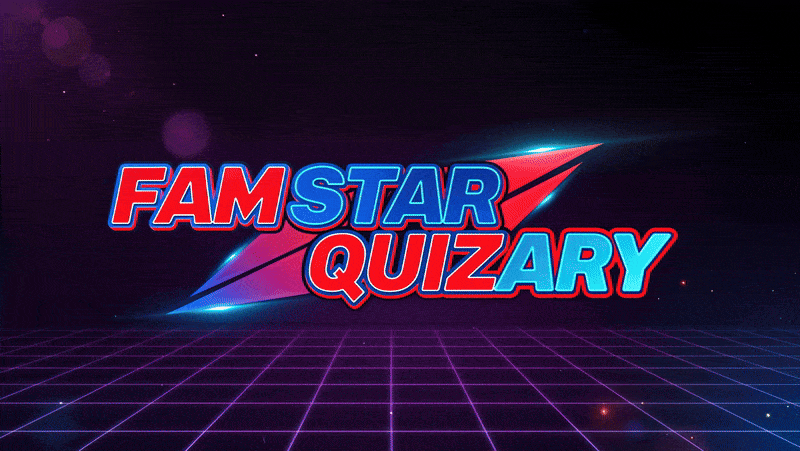

<b>The Ultimate Family Game Show Experience!</b>

---

## Description
**Fam Star Quizary** is a web-based family trivia game designed to deliver a fun, competitive, and interactive game show experience. Players can set up their profiles, choose difficulty levels, and compete in multiplayer quiz rounds featuring a wide variety of questions sourced from the OpenTDB API. The app features immersive visuals, wobble effects, and animations to replicate the excitement of a TV game show, with a celebratory victory sequence for the winner. Its goal is to provide an engaging, accessible, and family-friendly quiz platform suitable for all ages.

## Website
- **Website Link**: [View Website](https://udon171.github.io/fam-star-quizary/)

## User Goals
- Engage in a fun, competitive, and interactive trivia game suitable for family members of all ages.
- Enjoy a game show atmosphere with immersive visuals, sounds, and animations.
- Compete with up to four family members in a multiplayer quiz environment.
- Access a variety of trivia questions across multiple categories and difficulty levels.
- Experience a rewarding and celebratory victory sequence for the winner.

## User Stories
- As a family member, I want to easily set up a game with my name and profile icon so I can personalise my experience.
- As a player, I want to select from different difficulty levels to match my trivia knowledge and challenge preference.
- As a competitor, I want to use lifelines strategically in the head-to-head finale to increase my chances of winning.
- As a user, I want an intuitive and visually appealing interface so I can focus on the game without confusion.
- As a game enthusiast, I want immersive sound effects and animations to enhance the game show atmosphere.
- As a winner, I want a spectacular victory celebration to feel rewarded for my performance.

## Website Goals & Objectives
- Provide a seamless, family-friendly online quiz game for up to four players.
- Deliver an engaging game show experience with dynamic UI elements, sound effects, and animations.
- Ensure accessibility and responsiveness across devices, including desktops, tablets, and mobiles (future development).
- Integrate a reliable trivia API (opentdb.com) for endless, varied questions.
- Support future enhancements, such as additional categories, custom question sets, and mobile interactivity.

## Wireframes
- **Main Game Concept**: [View Wireframe Concept (PDF)](docs/FamStarQ%20Concept.pdf)  
  

- **Setup Menu Concept**: [View Wireframe Concept (PDF)](docs/FamStarQ%20Setup%20Game%20Concept.pdf)  
  

Wireframes outline the initial design for the game interface, including player setup, question display, and round transitions. These were created using Microsoft Visio for clarity and structure.

## Design Choices
The design aims to replicate a TV game show experience with vibrant visuals, intuitive navigation, and immersive effects:
- **Layout**: Central question display with player buzzers and profile icons for clear visibility.
- **Animations**: Curtain transitions, animated lights, and countdown timers to enhance immersion.
- **Interactivity**: Simplified setup process and interactive buzzers for ease of use.
- **Theme**: Bright, bold colours and game show-inspired elements to appeal to a wide audience, particularly younger players.

## Typography
- **Primary Font**: *Roboto* (Google Fonts) for its clean, modern look and readability across devices.
- **Secondary Font**: *Bebas Neue* (Google Fonts) for headings and titles to convey a bold, game show vibe.
- **Font Sizes**: 
  - Headings: 24–36px for prominence.
  - Body text: 16–18px for readability.
  - Buttons and buzzers: 18–20px for clarity.
- **Font Weights**: Regular (400) for body text, Bold (700) for headings and emphasis.

## Colour Scheme

Two colour palette options were considered to evoke a vibrant, game show atmosphere:

### Style A: Bright & Bold
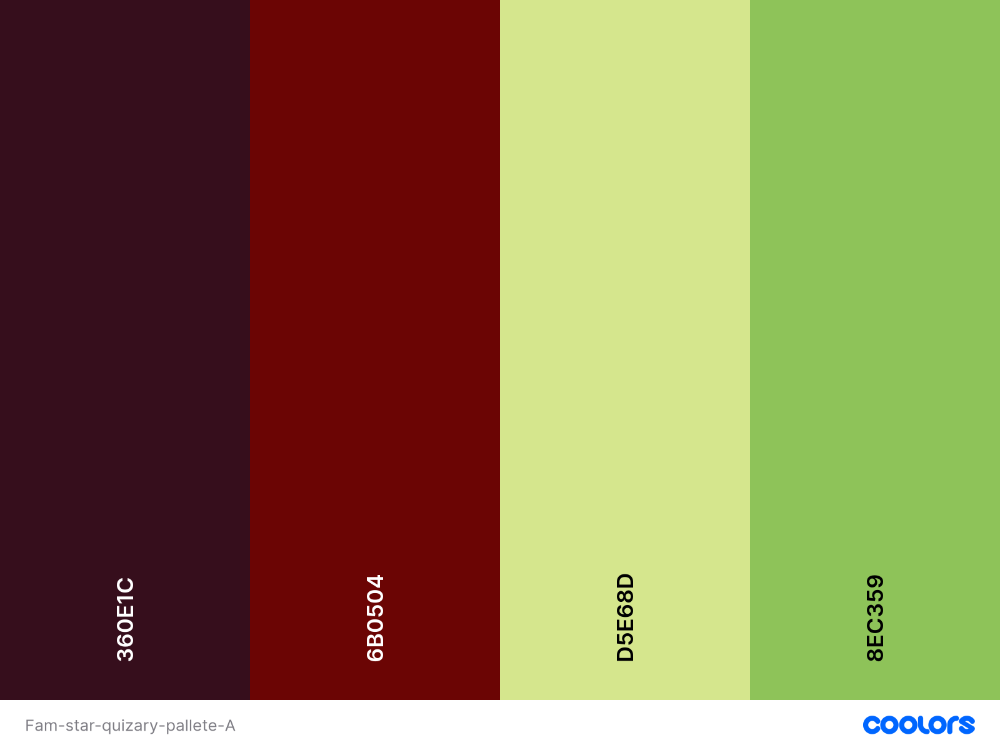
- Gold (`#FFD700`)
- Red (`#FF0000`)
- Blue (`#1E90FF`)
- Black (`#000000`)
- [View Palette](docs/Fam-star-quizary-pallete-A.png)

### Style B: Soft & Pastel
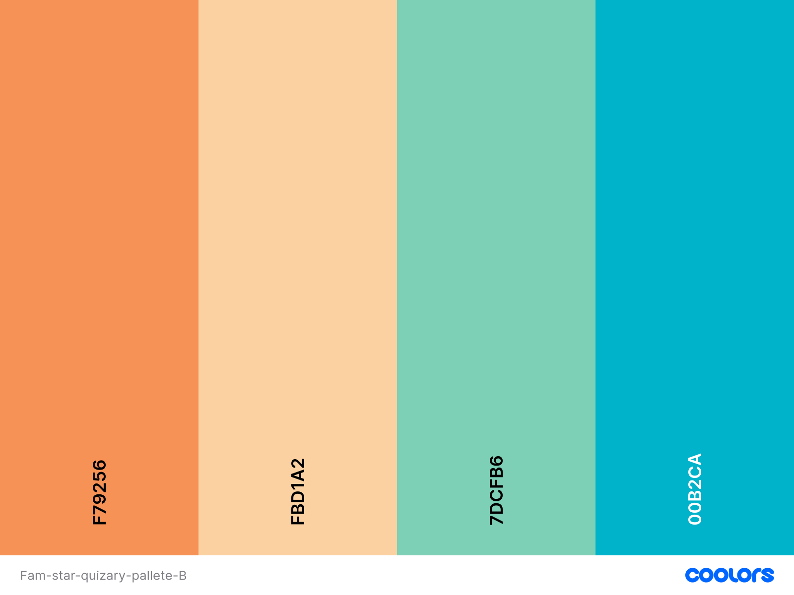
- Pastel Blue (`#87CEEB`)
- Pink (`#FF69B4`)
- Cream (`#FFF8DC`)
- [View Palette](docs/Fam-star-quizary-pallete-B.png)

**Chosen Palette:**  
Style A was selected for its energetic, TV show-inspired aesthetic, appealing to a younger demographic.

## Images
- **Trophy Icon**: Used in the victory sequence to crown the "King of the Fam". [View Image](docs/trophy.webp)
- **Banner**: Main promotional graphic for the game. [View Image](docs/fam-star-quizary-banner.webp)
- **Poppers and Fireworks**: Animated GIFs for the victory celebration. [View Poppers](docs/poppers.gif), [View Fireworks](docs/fireworks.gif)
- All images are optimised for web use, ensuring fast loading times without compromising quality.
- **FInal Images**: None used for final product one logo image used and icons:
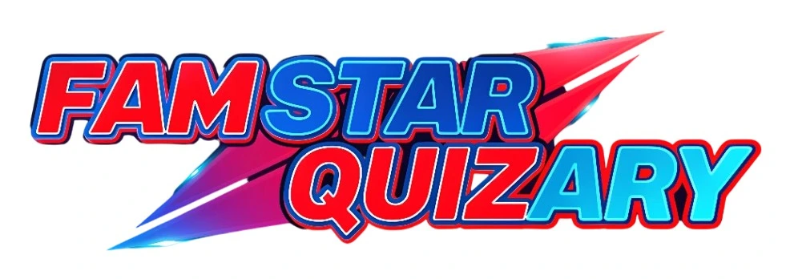

## Responsiveness
- The game is designed to be responsive across desktops and laptops, with plans for mobile and tablet support in future updates.
- Flexible layouts using CSS Grid and Flexbox ensure elements adapt to various screen sizes.
- Media queries adjust font sizes, button dimensions, and image scaling for smaller screens.
- Future mobile support will include interactive profile interfaces via a Python-based server (planned).

## Features

### Existing Features
- **Header**: Displays the game title and a navigation menu for setup and instructions.
- **Instructions**: Clear, collapsible sections explaining setup, rounds, and the timed score finale.
- **Feedback**: Visual cues for correct answers (Wiggle hover) and incorrect (Red fill), correct answers (Green fill).
- **Index**: Main game interface with a central question display, player icon & name, and animated background.
- **Footer**: Includes credits, API attribution (opentdb.com), and links to social media (future development).

## Technologies Used

### Languages
- **HTML5**: For structuring the game interface and content.
- **CSS3**: For styling, animations, and responsive design.
- **JavaScript**: For game logic, API integration, Automatic proccessing and dynamic interactions.

### Libraries
- **Font Awesome**: For UI icons (sourced from fontawesome.com).
- **Google Material Icons**: For additional interface icons (fonts.google.com/icons).
- **Google Fonts**: For Roboto and Bebas Neue fonts.
- **GitHub**: For JS quiz inspiration(e.g., other quiz apps).

### Framework
- No full frameworks (e.g., React) I am used to keeping the project lightweight. Future iterations may consider React for mobile support.

### Tools
- **Microsoft Visio**: For creating wireframes.
- **Git**: For version control.
- **GitHub**: For hosting the repository and deployment.
- **Co-Pilot:** For assisted coding and explaining.
- **VS Code**: For coding and debugging.
- **Notch**: For creating visual effects video files.
- **OpenTDB API**: For sourcing trivia questions (e.g., https://opentdb.com/api_category.php).

## Testing

### Bugs Fixed
- **Timer Issue**: Fixed a bug where the 60-second timer would occasionally reset prematurely.
- **API Latency**: Added fallback questions to handle slow API responses.
- **Answer Shown**: Used !important and added some js to fix end of round answers showing.

### Responsiveness Tests
- Tested on Chrome, Firefox, and Edge across desktop resolutions (1920x1080, 1366x768, 1280x720).
- Simulated mobile devices using Chrome DevTools (iPhone 12, Galaxy S20).
- Planned mobile support pending Python server integration for multi player functions.

### Code Validation
- **HTML**: Validated using W3C Markup Validator with no errors.
- **CSS**: Validated using W3C CSS Validator with no critical issues.

### External Testing
- **Mark**: Checked vie testing final build for external issues on diffrent browsers.
- **Ben**: Helped test through final two weeks with @media testing live during my development.

### User Story Testing
The project has changed so much this is more a feature check and change list related to user stories entrys.
- **Single Player Focus:** The game now supports only one player per session, removing multiplayer and family profile features for a streamlined solo experience.
- **Simplified Setup:** Users start the game with minimal setup—no profile icons or name entry—allowing for quick access to gameplay.
- **Difficulty Selection:** Players can choose from several difficulty levels, each affecting question complexity and timer duration, but there are no lifelines or finale rounds.
- **Direct Gameplay:** The quiz presents questions one after another, with instant feedback for correct or incorrect answers. There are no head-to-head or competitive elements.
- **Score System:** Scoring is based on correct answers and speed, with a time bonus added for faster responses, making each play through unique.
- **Visual & Audio Feedback:** The interface uses bright colors, clear layouts, and simple sound effects to maintain engagement, but advanced animations and immersive effects are limited.
- **Victory Screen:** At the end of the quiz, a summary screen displays the player’s score and a celebratory message, but there are no elaborate victory sequences or character celebrations.
- **How to Play:** The instructions modal is available and consistently works, ensuring users understand the game flow.
- **Logo Update:** The main heading was replaced with a logo image for a cleaner visual presentation.
- **Accessibility:** The interface remains accessible and responsive, but advanced multiplayer and customisation features are not present in this version.

### Manual Testing Results
Tracking component progress through vigorus testing as I built this project after the core pages were created:
| Feature                        | Tested Date   | Pass | Tested Date   | Pass | Tested Date   | Pass | Tested Date   | Pass |
|-------------------------------|--------------|------|--------------|------|--------------|------|--------------|------|
| Index, settings & quiz pages   | 2025-10-09   | ✅   | 2025-05-09   | ✅   | 2025-03-09   | ✅   | 2025-18-08   | ✅   |
| Difficulty selection function  | 2025-10-09   | ✅   | 2025-05-09   | ✅   | 2025-03-09   | ✅   | 2025-18-08   | ✅   |
| Question count-in timer        | 2025-10-09   | ✅   | 2025-05-09   | ✅   | 2025-03-09   |       | 2025-18-08   |    |
| Victory page (unique score)    | 2025-10-09   | ✅   | 2025-05-09   | ✅   | 2025-03-09   |       | 2025-18-08   |    |
| Select difficulty, 4 levels    | 2025-10-09   | ✅   | 2025-05-09   | ✅   | 2025-03-09   | ✅   | 2025-18-08   |    |
| Button effect (uniform look)   | 2025-10-09   | ✅   | 2025-05-09   | ✅   | 2025-03-09   |       | 2025-18-08   |     |
| How to Play modal setup        | 2025-10-09   | ✅   | 2025-05-09   | ✅   | 2025-03-09   | ✅   | 2025-18-08   |    |
| Responsive layout              | 2025-10-09   | ✅   | 2025-05-09   | ✅   | 2025-03-09   |      | 2025-18-08   |    |
| Accessibility (ARIA/contrast)  | 2025-10-09   | ✅   | 2025-05-09   |       | 2025-03-09   |      | 2025-18-08   |    |
| API question loading           | 2025-10-09   | ✅   | 2025-05-09   | ✅   | 2025-03-09   | ✅   | 2025-18-08   |    |
| 404.html auto homepage  | 2025-10-09   | ✅   | 2025-05-09   |    | 2025-03-09   |    | 2025-18-08   |    |

Kept a custom record of specfic problems and solutions near the end of the project:
| Page         | Issue Description                                         | Resolution                                                                 | Commit Date     | Author   |
|--------------|----------------------------------------------------------|----------------------------------------------------------------------------|-----------------|----------|
| game-over    | Background video not showing on page                     | Fixed Game Over background video not showing on page                        | Sep 4, 2025     | D.Wells  |
| game-over    | Refined stlye of sizing and spacing | Found balanced look for final adjustment.md                                 | Sep 4, 2025     | D.Wells  |
| game-settings| Difficulty cards not fully clickable or visually selectable| Adjusted game settings page to make difficulty cards fully clickable and visually selectable | Sep 3, 2025     | D.Wells  |
| quiz         | Unbalanced quiz look and non-smooth timer                | Updated quiz look for more balance and smoother timer, improving code clarity and maintainability | Sep 3, 2025     | D.Wells  |
| index        | Missing features  & size alterations                | Adjusted general sizes & position to index features.html                             | Sep 3, 2025     | D.Wells  |
| game-settings| Difficulty selection ability and sizing/positioning  | Adjusted by deleteing select dot and making card selectable in game-settings.html                     | Sep 3, 2025     | D.Wells  |
| game-over    | Inconsistent names and missing features                  | Adjusted names and added features to game-over.html                         | Sep 3, 2025     | D.Wells  |
| index        | Modal show/hide functionality using direct style manipulation | Added modal show/hide functionality using CSS class toggling with 'show' class | Sep 3, 2025     | D.Wells  |

### Automated Testing Results

**W3C Validation**
- **HTML**:  
  -   
  - [View Full Report](https://validator.w3.org/nu/?doc=https%3A%2F%2Fudon171.github.io%2Ffam-star-quizary%2F)
  - **Result**: Passed with no critical errors.
- **CSS**:  
  -   
  - [View Full Report](https://jigsaw.w3.org/css-validator/validator?uri=https%3A%2F%2Fudon171.github.io%2Ffam-star-quizary%2F&profile=css3svg&usermedium=all&warning=1&vextwarning=&lang=en#css)
  - **Result**: Passed, with minor warnings (see [CSS error screenshot](docs/w3c%20css%20validation%20error.PNG)).

**Lighthouse Audits**
- **Performance, Accessibility, Best Practices, SEO**:
  - 
  - 
  - [View Online Report](https://lighthouse-metrics.com/lighthouse/checks/c79fb7a5-cd9f-43cb-85d1-087d10a2bec5)
  - **Scores**:  
    - Performance: 88/100  
    - Accessibility: 100/100  
    - Best Practices: 96/100  
    - SEO: 90/100

All automated tests confirm the site is well-structured, accessible, and performance, with only minor CSS warnings that do not affect functionality.

### Accessibility Testing
- Ensured high-contrast colours (Style A+B palettes) for readability.
- Added ARIA labels for buzzers and interactive elements.
- Tested with screen readers (NVDA, VoiceOver) for basic compatibility.

### Browser Testing
- **Chrome**: Fully functional.
- **Firefox**: Minor animation delay fixed.
- **Edge**: No issues.
- **Brave**: No issues.
- **Safari**: Planned for future testing with mobile support.

## Deployment

### To Deploy the Project
1. Host the project on GitHub Pages or a static web server.
2. Ensure all assets (images, scripts, styles) are correctly linked.
3. Update the base URL in API calls if deploying to a custom domain.

### To Fork the Project
1. Navigate to the repository: [Fam Star Quizary](https://github.com/Udon171/fam-star-quizary).
2. Click "Fork" on GitHub to create a copy in your repository.
3. Clone your fork locally to make changes.

### To Clone the Project
1. Run `git clone https://github.com/Udon171/fam-star-quizary`.
2. Open the project in a code editor (e.g., VS Code).
3. Serve locally using a tool like Live Server or deploy to a web server.

## Images of Website

Below are screenshots showcasing the Fam Star Quizary website and its main features:

| Page / Feature                | Screenshot                                                                                   |
|-------------------------------|---------------------------------------------------------------------------------------------|
| **Game Over Screen**          | 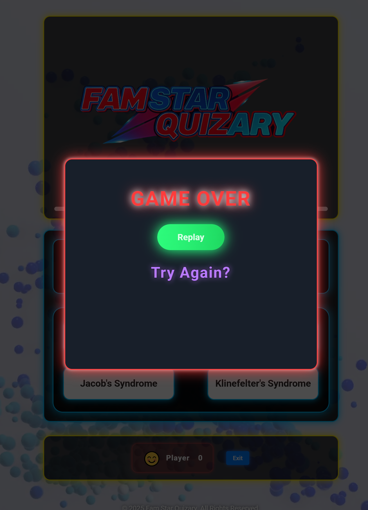                                                        |
| **How to Play Modal**         | 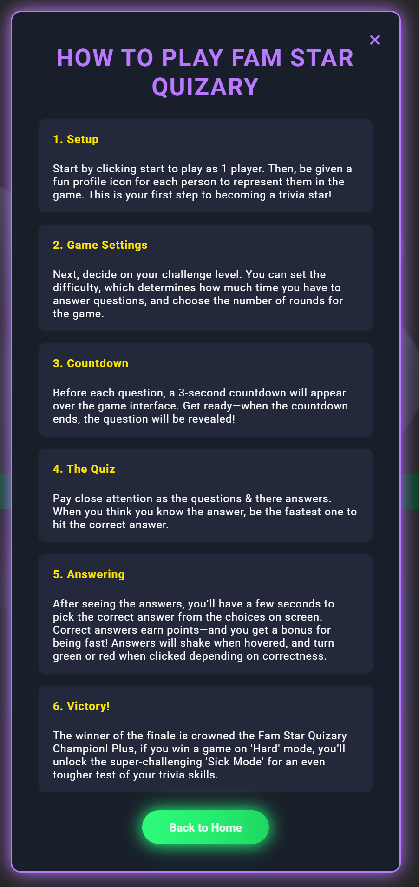                                                 |
| **Home / Index Page**         | 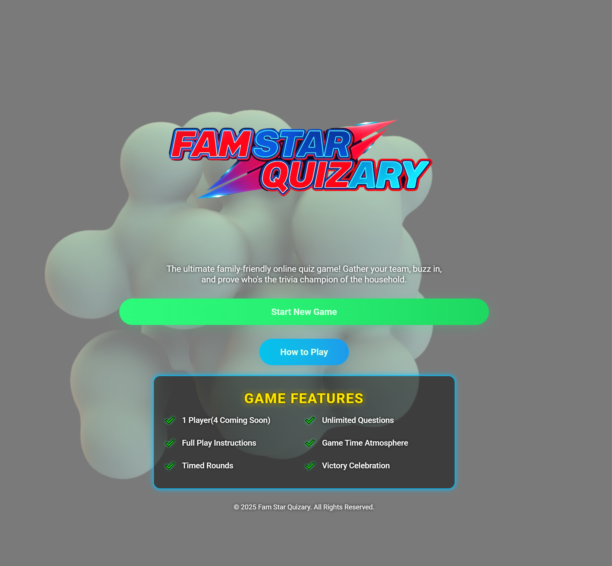                                                                |
| **Quiz - Incorrect Answer**   | 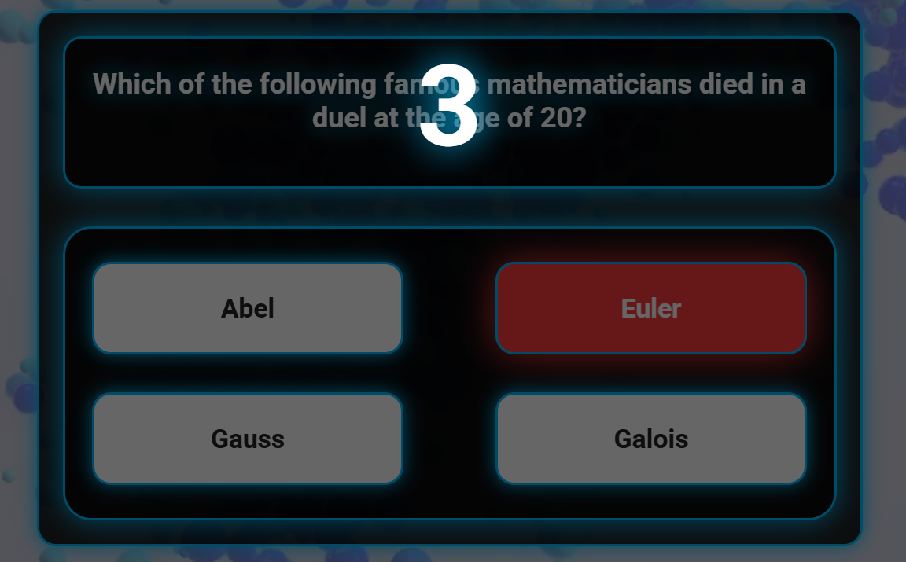                                     |
| **Quiz - Correct Answer**     | 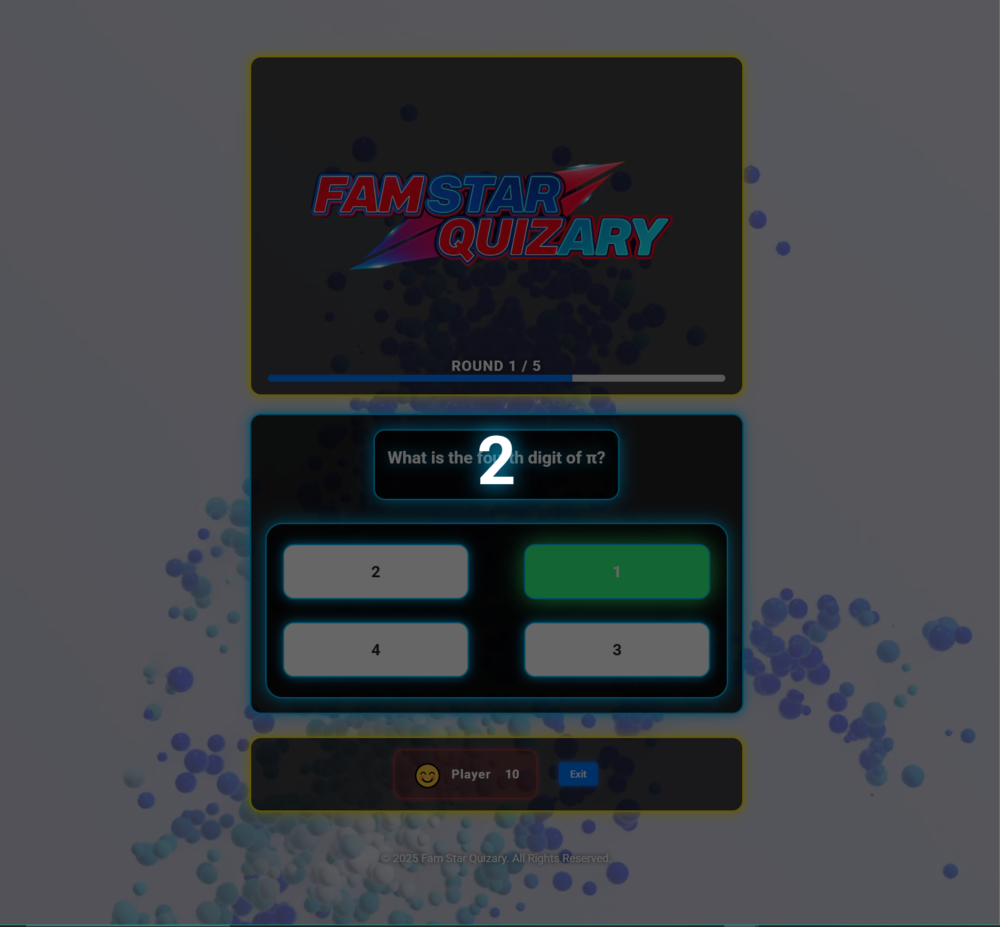                                        |
| **Quiz In Progress**          | 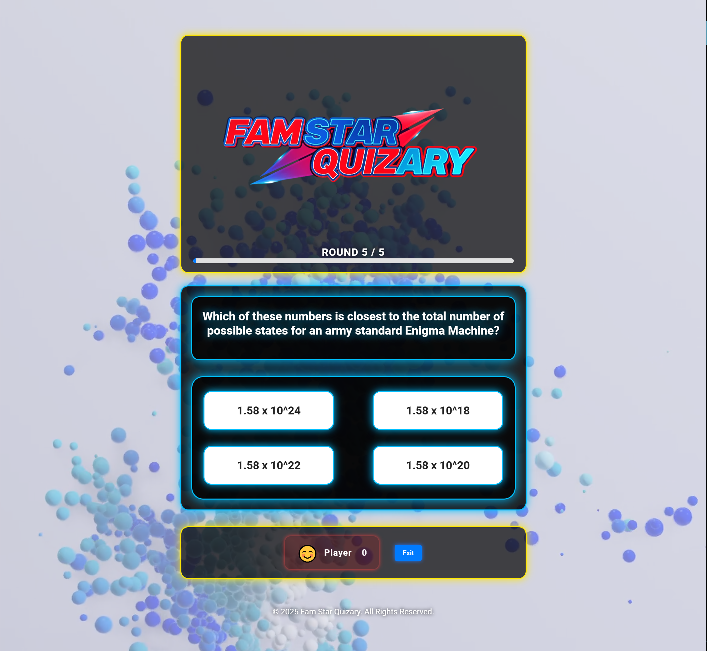                                                                  |
| **Settings - Difficulty Selection** | 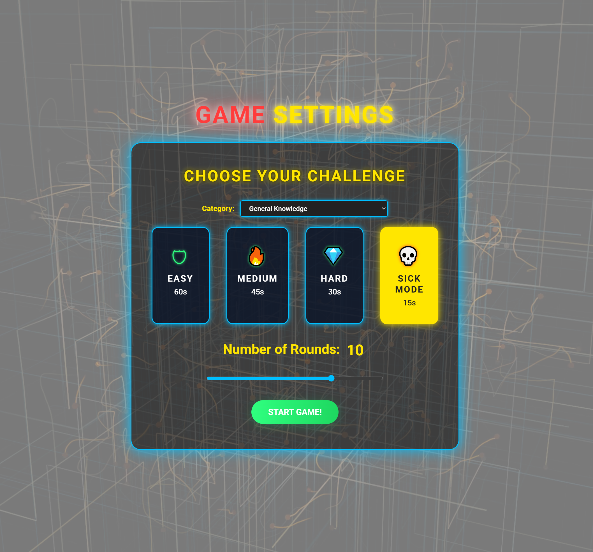                                 |
| **Settings Page**             | 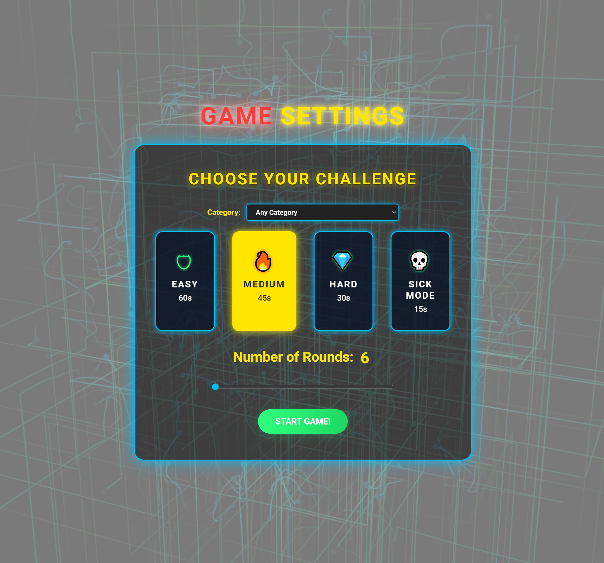                                                          |
| **Winner / Victory Screen**   |                                                               |

These images demonstrate the user flow from starting, setup, gameplay and to the final feedback victory celebration. Images show a representation of the background video files used for each experiance of the game.

## Credits
- **OpenTDB API**: For providing unlimited trivia questions ([opentdb.com](https://opentdb.com)).
- **Google Fonts**: For Roboto and Bebas Neue fonts.
- **Animate.css**: For animation effects.
- **Images**: Logo sourced from kling.ai generated with custom refrence.
- **Code Institute**: Coding education in HTML, CSS & JS.

## Project Diary

### Entry 1: Project Kickoff
- Outlined **Fam Star Quizary** concept and gameplay.
- Defined multiplayer features, lifelines, and game show atmosphere.
- Selected technical stack and OpenTDB API.
- Planned UI/UX with banners, icons, and animations.
- Identified future improvements: more categories, custom sets, mobile support.

### Entry 2: API Information & Colour
- Provided API URLs for question sets:
  - [50 General Easy](https://opentdb.com/api.php?amount=50&category=9&difficulty=easy)
  - [50 General Medium](https://opentdb.com/api.php?amount=50&category=9&difficulty=medium)
  - [50 General Hard](https://opentdb.com/api.php?amount=50&category=9&difficulty=hard)
  - [50 Anime Easy](https://opentdb.com/api.php?amount=50&category=31&difficulty=easy)
  - [50 Anime Medium](https://opentdb.com/api.php?amount=50&category=31&difficulty=medium)
  - [50 Anime Hard](https://opentdb.com/api.php?amount=50&category=31&difficulty=hard)
  - [50 Film Easy](https://opentdb.com/api.php?amount=50&category=11&difficulty=easy)
  - [50 Film Medium](https://opentdb.com/api.php?amount=50&category=11&difficulty=medium)
  - [50 Film Hard](https://opentdb.com/api.php?amount=50&category=11&difficulty=hard)
- Explored colour palettes: Style A (bold) and Style B (pastel). Chose Style A.

### Entry 3: Concept Update
- Amended concept to plan mobile/tablet interactivity (future Python server).
- Simplified UI for setup and round progression.
- Added clear question displays, lifeline progress, and profile characters.
- Designed curtain and camera movement animations for round transitions.
- Named "Fam Star Quizary" to appeal to younger demographics.
- USe all catergorys API: https://opentdb.com/api_category.php

### Entry 4: Wireframe Design
- Created wireframes for main game and setup menu using Visio:
  - [Main Game Concept](docs/FamStarQ%20Concept.pdf)
  - [Setup Menu Concept](docs/FamStarQ%20Setup%20Game%20Concept.pdf)

### Entry 5: Pre-Programming Path
- Selected HTML, CSS, and JavaScript for development.
- Focused on user experience goals: intuitive setup, immersive gameplay, and clear feedback.
- Used projects in github for build goals

### Entry 6: Development Insight
- Change of prioritize using Minimum Viable Product (MVP) Princables

Starting out I had my project section of github loaded with my planned development path. 
One thing I wanted to implement (but couldn't) was the tick box for the inner content which would have helped after using MVP principals. Regardless, I used the project section of github, to manage the extra tasks from the basic, for a working product. The first complication of having 4 players over a one player setup were easy to see, needed a redirection to the one player setup. Server, database or external modile/tablet use was removed for none applicable reasons.

This was then followed by a complete overhaul at some features of show elements and was cut from the current direction of the project. This brought it back to a handfull of my project titles and content to produce a functioning one player quiz with a settings page and a start page to work (this is reflected in my projects section). 
Looking online at other quiz's JS code through github to understand the natue of using the api also made me realize I can call the single api instead of pre 50 questions as researched prior (as shown above in the diary). Making the basic working site was rewarding in itself but was done for a timed deadline and still needs more work to style and add any missing elements. I did not expect any issues as I had the basic's working. 

- The re-direct of style for the application of CSS

With the quick help from inspiration of design I had a direction for the new basic build of the project. Getting the first pages done was a breeze and established the new look for the first time. With no hiccups I moved on to the quiz page and applied the same style elements to the quiz with a few changes of timer location and other bits moving to a prevous page nothing too drastic. Once done the quiz was gone, but the style was almost there but no quiz. After trying some basic changes like changing z-index as well as others, I moved on to making elements @important which fixed the none showing quiz section further adjustments to style to get the quiz completley right became a bit more of a challenge with sevral attempts to achieve the final look (this included a change of text colour to name one).

### Final Adjustments, Testing, Resposiveness and Accessablity

A: After getting the base project completed to a working stage for pre hand in. I have now had a second look at each page to refine and test this project build. See table below for list of adjustements of these pages.

| Page         | Issue Description                                         | Resolution                                                                 | Commit Date     | Author   |
|--------------|----------------------------------------------------------|----------------------------------------------------------------------------|-----------------|----------|
| game-over    | Background video not showing on page                     | Fixed Game Over background video not showing on page                        | Sep 4, 2025     | D.Wells  |
| game-over    | Refined stlye of sizing and spcing | Found balanced look for final adjustment.md                                 | Sep 4, 2025     | D.Wells  |
| game-settings| Difficulty cards not fully clickable or visually selectable| Adjusted game settings page to make difficulty cards fully clickable and visually selectable | Sep 3, 2025     | D.Wells  |
| quiz         | Unbalanced quiz look and non-smooth timer                | Updated quiz appearance, for a more balanced look and smoother timer, improving code clarity and maintainability | Sep 3, 2025     | D.Wells  |
| index        | Missing features  & size alterations                | Adjusted general sizes & position to index features.html                             | Sep 3, 2025     | D.Wells  |
| game-settings| Difficulty selection ability and sizing/positioning  | Adjusted by deleting select dot and making card selectable in game-settings.html                     | Sep 3, 2025     | D.Wells  |
| game-over    | Inconsistent names and missing features                  | Adjusted names and added features to game-over.html                         | Sep 3, 2025     | D.Wells  |
| index        | Modal show/hide functionality using direct style manipulation | Added modal show/hide functionality using CSS class toggling with 'show' class | Sep 3, 2025     | D.Wells  |

### B: Testing

Manual Testing
| Feature                        | Tested Date   | Pass | Tested Date   | Pass | Tested Date   | Pass | Tested Date   | Pass |
|-------------------------------|--------------|------|--------------|------|--------------|------|--------------|------|
| Index, settings & quiz pages   | 2025-10-09   | ✅   | 2025-05-09   | ✅   | 2025-03-09   | ✅   | 2025-18-08   | ✅   |
| Difficulty selection function  | 2025-10-09   | ✅   | 2025-05-09   | ✅   | 2025-03-09   | ✅   | 2025-18-08   | ✅   |
| Question count-in timer        | 2025-10-09   | ✅   | 2025-05-09   | ✅   | 2025-03-09   |       | 2025-18-08   |    |
| Victory page (unique score)    | 2025-10-09   | ✅   | 2025-05-09   | ✅   | 2025-03-09   |       | 2025-18-08   |    |
| Select difficulty, 4 levels    | 2025-10-09   | ✅   | 2025-05-09   | ✅   | 2025-03-09   | ✅   | 2025-18-08   |    |
| Button effect (uniform look)   | 2025-10-09   | ✅   | 2025-05-09   | ✅   | 2025-03-09   |       | 2025-18-08   |     |
| How to Play modal setup        | 2025-10-09   | ✅   | 2025-05-09   | ✅   | 2025-03-09   | ✅   | 2025-18-08   |    |
| Responsive layout              | 2025-10-09   | ✅   | 2025-05-09   | ✅   | 2025-03-09   |      | 2025-18-08   |    |
| Accessibility (ARIA/contrast)  | 2025-10-09   | ✅   | 2025-05-09   |       | 2025-03-09   |      | 2025-18-08   |    |
| API question loading           | 2025-10-09   | ✅   | 2025-05-09   | ✅   | 2025-03-09   | ✅   | 2025-18-08   |    |
| 404.html auto homepage  | 2025-10-09   | ✅   | 2025-05-09   |    | 2025-03-09   |    | 2025-18-08   |    |

### Automatic Testing
- W3C -  
   HTML -[HTML-FSQ](docs\w3c%20html%20validation.PNG)   https://validator.w3.org/nu/?doc=https%3A%2F%2Fudon171.github.io%2Ffam-star-quizary%2F  
   CSS error -[CSS-FSQ error](docs/w3c%20css%20validation%20error.PNG)   
   CSS -[CSS-FSQ](docs\w3c%20css%20validation.PNG)     https://jigsaw.w3.org/css-validator/validator?uri=https%3A%2F%2Fudon171.github.io%2Ffam-star-quizary%2F&profile=css3svg&usermedium=all&warning=1&vextwarning=&lang=en#css  
- Lighthouse -  
    - [LGSQ-p1](docs\lighthouse%20FSQ%20p1.PNG) 
    - [LGSQ-p2](docs\lighthouse%20FSQ%20p2.PNG) https://lighthouse-metrics.com/lighthouse/checks/c79fb7a5-cd9f-43cb-85d1-087d10a2bec5  

**Events of Testing/Refining**   
- First issue to get fixed a correct answer bug that happened when leaving the timer to go to zero then revealing the answer in green. Fixed by restricting the anwser function in quiz.js.  
- Second issue, the end page for getting a score was not displaying a total score +. I renamed file to winner.html and used !important in css this fixed those issues.  
- Third issue, To make the score more competetive for playing the quiz I added a time bonus mode. Quicker anwsers get bigger scores. 
- Fourth thing I realised the sick mode difficulty had no function as the api does not suppport sick mode. I created my specfic sick mode using hard questions from 3 catogarys Maths, Science & Technology with just 15sec to answer felt good to me and after checking the api I made my sick mode optional.  
After all this problem solving it came to a solid run of commits but nothing changed on the pages website hhhhmmmm why 3 weeks old I said hhhmmm. I removed the pages entry to then re upload the pages entry this has corrected all issues (mainly expired issue).  

### C: Resposive & Accesablility
- 600 or 768 for mobile? 768 pixels allowing certain higher amount of devices use the mobile layout. 
- Mobile kept a vertical look filling the screen some titles need top space,the quiz need all answers resized to be visible.  
1080px issue with settings heading off screen adjusted via @media 1080 adding space to top of H1.  
- All buttons were made effect reactive to offer visual direction. Early decision to use green fill for correct and red for wrong but I added the wobble for easy visual selecting, keeping the visual inputs fast for question time.  
- Changing video name Defomers = v1 Turbulance = v2 particle flow = v5 particle = v3 particle 2 = v4. All converted and being modified in the code.
- A lot of my design choices were to create a more minimal adjustments for resolution changes keeping a centre of screen focused approach and using video for the contrast with a minimal layout concept. This aspect worked better than I expected.

### Entry 7: Project Reflection
- **Final Thoughts**: After finishing the project and having such drasting changes when faced with time constraints as deadlines came closer and closer. Design focus changed using MPV approach for the core functions to be built and then refine a design around that with infuence from the planning.
- My ablitiy with creating video let me take my intial concept and use in a more modern blend with pastal colours of the background and bright 80s feel logo the function became a bug and error monster it was always going to be...
- **Logic Ideas**: After making some changes and developmants through the project with the logic elements. I've come to further realise the time and questions are a good start but adding a (x) times element to the rounds that get a special multiplier if consecutive correct answers are achived. This would create the most fairest outcome with time based rounds as low (x) values for easy mode & the higher (x) values for hard mode. The skill of anwsering the questions should reward the user the most.
- Creating the 4 player element with rounds leading to a head to head would best suite the use of Python and would really benfit from a server enabling remote use of mobile/tablets for multiplayer connections and participtaion.

Stay Frosty...